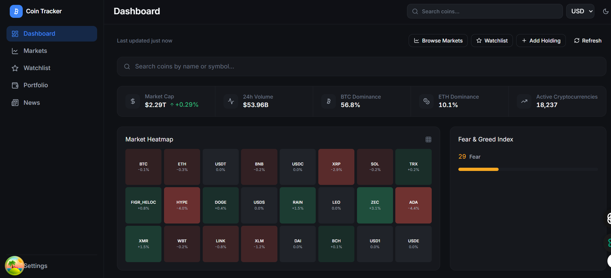
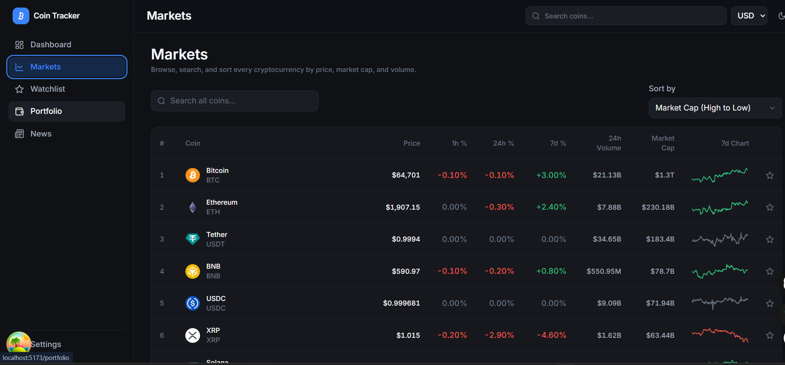
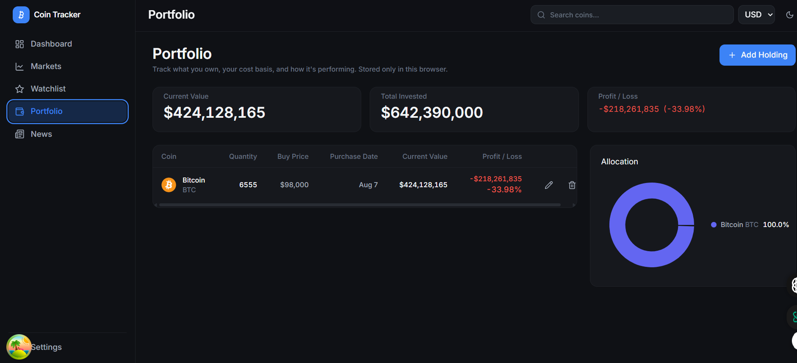
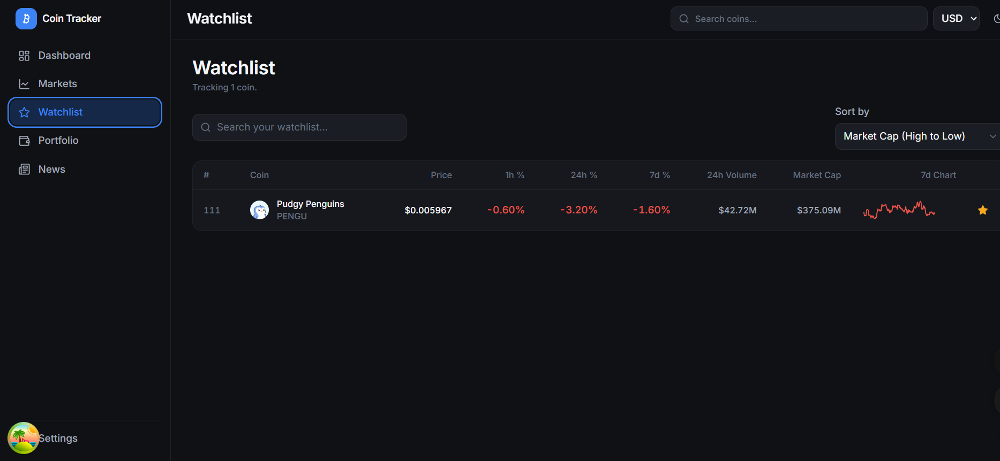
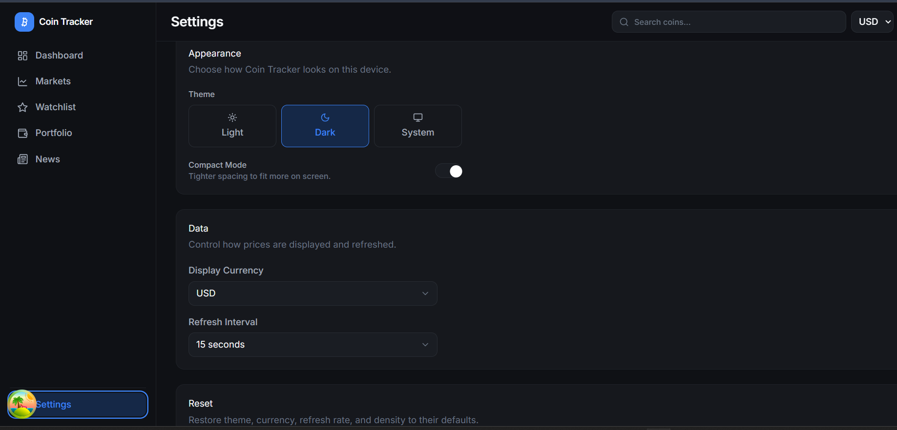

# Coin Tracker

A modern cryptocurrency tracking platform built with React, TypeScript, TanStack Query, and Zustand. It provides real-time market insights, portfolio tracking, watchlists, and interactive charts through a clean, responsive interface.
Built with React 19, TypeScript (strict), Vite, Tailwind CSS, TanStack
Query, and Zustand.


🌐 Live Demo:
https://your-vercel-link.vercel.app

## Overview

Coin Tracker is a single-page app that reads live data from the CoinGecko
API and layers a full product experience on top of it: browsing and
searching the entire coin market, drilling into a coin's history and
statistics, tracking coins you care about, and modeling a portfolio you own
— all without a backend of its own. Everything a user creates (watchlist,
portfolio, preferences) is stored in `localStorage` and never leaves the
browser.

It's built to the standard of a real product, not a tutorial project:
strict TypeScript, a real design system, loading/error/empty states on
every screen, accessible interactive elements, route-level code splitting,
and a test suite — not just a demo that only works on the happy path.

## Features

- **Dashboard** — global market stats (market cap, volume, BTC/ETH
  dominance, active cryptocurrencies), a Fear & Greed gauge, a market
  heatmap, trending coins, top gainers/losers, a watchlist preview, quick
  actions, and a live "last updated" indicator.
- **Markets** — every coin, searchable (debounced, hits CoinGecko's
  `/search`), sortable by price/market cap/volume/name, paginated, with
  URL-persisted state so a refresh or shared link keeps your view. Responsive
  table on desktop, cards on mobile.
- **Coin Details** — hero with live price and rank, a multi-timeframe chart
  (24H / 7D / 30D / 90D / 1Y) with tooltips, a full statistics grid (market
  cap, volume, supply, ATH/ATL, ROI), sanitized description, official links,
  a price converter, and related coins.
- **Watchlist** — star any coin from Markets or its detail page; the full
  Watchlist page adds local search and sorting on top.
- **Portfolio** — add/edit/delete holdings (coin, quantity, buy price,
  purchase date) through a validated form; see current value, cost basis,
  profit/loss (absolute and %), and an allocation pie chart. 100% local.
- **Settings** — theme (light/dark/system), display currency, refresh
  interval, and a compact-density mode, with a confirm-guarded reset.
- **News** — a card grid of recent crypto headlines.
- **Global search** — a command-palette-style search in the top bar with
  keyboard navigation and recent searches.
- Toast notifications, skeleton loading states, friendly error states with
  retry, empty states, and a 404 page — no blank screens, anywhere.

## Tech stack

| Concern | Choice |
|---|---|
| Framework | React 19 + TypeScript (strict, `noUncheckedIndexedAccess`) |
| Build tool | Vite |
| Styling | Tailwind CSS + CSS-variable design tokens |
| Server state | TanStack Query |
| Client state | Zustand (+ `persist` middleware for local storage) |
| Forms | React Hook Form + Zod |
| Charts | Recharts |
| Animation | Framer Motion |
| Routing | React Router v6 (lazy-loaded routes) |
| Testing | Vitest + React Testing Library |
| Linting | ESLint (flat config) + `jsx-a11y` + `typescript-eslint` |

## Getting started

```bash
npm install
cp .env.example .env
```

Edit `.env` and set your CoinGecko API key:

```
VITE_COINGECKO_API_KEY=your_key_here
VITE_COINGECKO_API_TIER=demo   # or "pro" if you're on a paid plan
```

Get a free Demo key at https://www.coingecko.com/en/developer/dashboard.

```bash
npm run dev             # start the dev server
npm run build            # type-check + production build
npm run preview           # preview the production build locally
npm run lint               # eslint, zero warnings allowed
npm run format              # prettier --write
npm run test                 # run the test suite once
npm run test:watch            # run tests in watch mode
npm run test:coverage          # run tests with a coverage report
```

## Architecture

```
src/
├── app/            # Root providers (QueryClientProvider, devtools)
├── api/            # HTTP layer: CoinGecko client, endpoints, news, fear/greed, error types, query keys
├── components/
│   ├── ui/         # Design-system primitives: Button, Card, Badge, Skeleton, Input, Select, Dialog, Pagination, Tabs
│   ├── charts/     # Recharts-based visualizations (Sparkline)
│   ├── layout/     # AppShell, Sidebar, Topbar, ThemeToggle
│   ├── navigation/ # NavItem, nav config
│   ├── feedback/   # EmptyState, ErrorState, ErrorBoundary, PageLoader, Toaster
│   └── common/     # Domain components shared across features (PriceChange, CoinIcon, CurrencySelect, CoinTable, WatchlistButton)
├── features/       # One folder per product area — dashboard, markets, coin, watchlist, portfolio, settings, news, search, not-found
│   └── <feature>/
│       ├── hooks/       # Feature-specific TanStack Query hooks
│       ├── components/  # Feature-specific UI
│       └── *Page.tsx    # The route entry point
├── hooks/          # Generic, feature-agnostic hooks (useDebounce, usePageTitle, useMediaQuery)
├── lib/            # cn(), queryClient
├── store/          # Zustand: theme, preferences, watchlist, portfolio, toasts, recent searches (client state only)
├── styles/         # globals.css — design tokens as CSS variables
├── types/          # Shared TypeScript types
├── utils/          # format.ts, html.ts — single source of truth for formatting/sanitizing
├── test/           # Vitest setup
└── routes/         # Router config (lazy-loaded routes)
```

### Key architectural decisions

- **Server state vs. client state is strictly separated.** TanStack Query
  owns everything that comes from the network (prices, market data, news).
  Zustand only holds UI/user state (theme, currency preference, watchlist
  IDs, portfolio holdings, toasts). This is what makes the app
  "backend-agnostic": swapping CoinGecko for a future proprietary backend
  only touches `src/api/`.
- **No duplicate caching layer.** The HTTP client (`src/api/coingecko/client.ts`)
  handles retries/backoff/timeouts but deliberately does not cache responses
  itself — TanStack Query already de-duplicates concurrent identical requests
  and owns the cache.
- **Design tokens live in CSS variables**, not just Tailwind config, so theme
  switching and compact-mode density are single class toggles on `<html>`
  with zero re-renders.
- **Tabular numerals everywhere financial figures appear** (`.font-tabular`)
  — chosen because ticking numbers that don't jitter read as "engineered,"
  the way a real trading terminal does.
- **`useMarketsSnapshot`** fetches the top-100-by-market-cap list once and
  several dashboard widgets (top movers, heatmap, watchlist preview, quick
  search, related coins) all read from the same cached query — avoiding
  duplicate requests on page load. The Markets page uses its own paginated
  hook with page/sort/search params; Watchlist and Portfolio fetch exactly
  the IDs they need so they aren't limited to the top 100.
- **Search is a two-hop join, not a client-side filter.** CoinGecko's
  `/coins/markets` has no free-text search param, so Markets/Watchlist/the
  global search resolve a query via `/search` (lightweight matches across
  the whole coin universe) and then fetch full market data for just those
  IDs — both steps independently cached.
- **No `dangerouslySetInnerHTML`.** Coin descriptions and news bodies arrive
  as HTML from third-party APIs; `utils/html.ts#stripHtml` strips tags and
  decodes entities into plain text before rendering, rather than trusting
  and injecting raw HTML.
- **Manual Zod validation instead of `@hookform/resolvers`.** The portfolio
  form validates via `schema.safeParse` + `setError` to avoid pulling in an
  extra dependency for what's a few lines of code.

## Testing

```bash
npm run test
```

Covers formatting utilities, the HTML-sanitizing/relative-time utilities,
the `useDebounce` hook, the watchlist and portfolio Zustand stores, a shared
component (`PriceChange`), and the portfolio form's Zod validation schema.
Run `npm run test:coverage` for a coverage report.

## Deployment

This is a static SPA — build it and serve `dist/` from any static host
(Vercel, Netlify, Cloudflare Pages, GitHub Pages, S3 + CloudFront, etc.).

```bash
npm run build
```

**Environment variables** (set these in your host's dashboard, or in `.env`
for local builds):

| Variable | Required | Description |
|---|---|---|
| `VITE_COINGECKO_API_KEY` | Yes | Your CoinGecko API key |
| `VITE_COINGECKO_API_TIER` | Yes | `demo` or `pro`, depending on your plan |

Because this is a client-only app, the API key ships in the built bundle —
use a Demo-tier key with CoinGecko's public rate limits in mind, not a
secret you'd protect server-side.

**CI/CD:** `.github/workflows/ci.yml` runs lint → typecheck → test → build
on every push and pull request to `main`.

## 📸 Screenshots

### Dashboard



### Markets



### Portfolio



### Watchlist



### Settings




## Contributing

See [CONTRIBUTING.md](./CONTRIBUTING.md) for the development workflow and
code style guide. Bug reports and feature requests should use the issue
templates under `.github/ISSUE_TEMPLATE/`.

## Notes on data sources

- All market data comes from the live CoinGecko API — no mock/fake data
  anywhere in the app.
- The Fear & Greed Index comes from `alternative.me` (CoinGecko has no
  equivalent endpoint); see `src/api/fearGreed.ts`.
- News comes from CryptoCompare's public news feed; see `src/api/news.ts`.

## License

MIT — see [LICENSE](./LICENSE).
